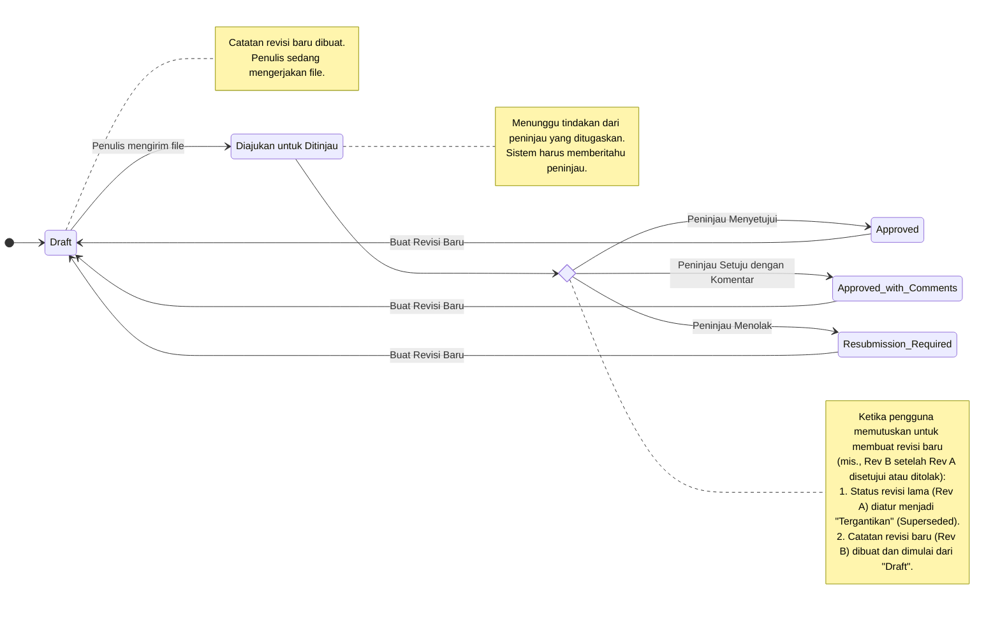
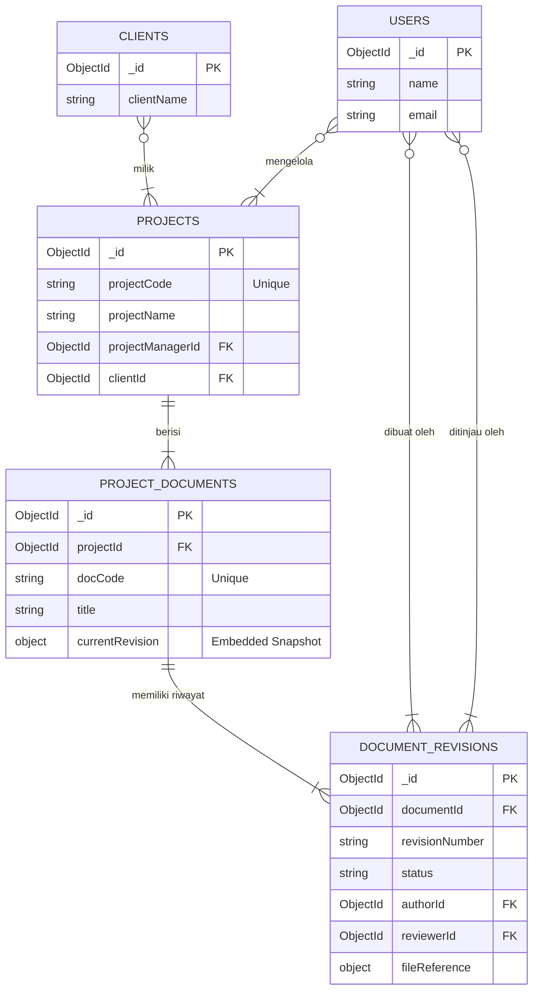
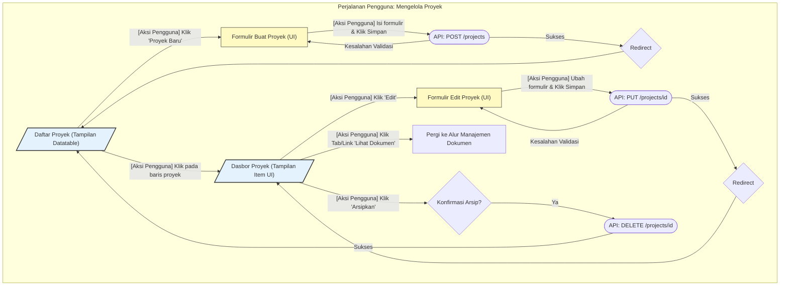

## 2025-09-05
### 1. Struktur Definisi Proyek (Collection MongoDB: `projects`)

Di MongoDB, ini akan menjadi collection `projects` Anda. Setiap dokumen dalam collection ini merepresentasikan satu proyek tunggal.

#### Model Proyek yang Diusulkan (`Project.php`)

```php
// app/Models/Project.php
class Project extends Jenssegers\Mongodb\Eloquent\Model
{
    protected $connection = 'mongodb';
    protected $collection = 'projects';

    /**
     * Atribut yang dapat diisi secara massal.
     *
     * @var array
     */
    protected $fillable = [
        'projectCode',
        'projectName',
        'description',
        'projectManagerId',
        'clientId',
        'status',
        'startDate',
        'plannedEndDate',
        'actualEndDate',
        'budget',
        'currency',
    ];

    /**
     * Atribut yang akan di-cast ke tipe data native.
     *
     * @var array
     */
    protected $casts = [
        'startDate' => 'datetime',
        'plannedEndDate' => 'datetime',
        'actualEndDate' => 'datetime',
        'budget' => 'float',
    ];
}
```

#### Definisi Field (collection `projects`)

| Nama Field | Tipe Data (MongoDB) | Deskripsi | Contoh |
| :--- | :--- | :--- | :--- |
| `_id` | ObjectId | Identifier unik yang dibuat secara otomatis (Primary Key). | `ObjectId("63a0c2b...")` |
| `projectCode` | String (Unique Index)| Identifier unik untuk proyek yang mudah dibaca manusia. | `PROJ-2024-001` |
| `projectName` | String | Nama resmi proyek. **(Diperlukan)** | `Corporate Website Redesign`|
| `description` | String | Deskripsi rinci mengenai ruang lingkup dan tujuan proyek. | `To rebuild the public-facing website...`|
| `projectManagerId`| ObjectId | `_id` dari pengguna pada collection `users`. | `ObjectId("63a0d1e...")` |
| `clientId` | ObjectId | `_id` dari klien pada collection `clients`. Dapat bernilai null. | `ObjectId("63a0e4f...")` |
| `status` | String | Status proyek saat ini. **(Diperlukan)** | `In Progress` |
| `startDate` | ISODate | Tanggal mulai proyek yang direncanakan atau aktual. | `2024-09-01T00:00:00.000Z`|
| `plannedEndDate` | ISODate | Tanggal penyelesaian yang direncanakan semula. | `2025-03-31T00:00:00.000Z`|
| `actualEndDate` | ISODate | Tanggal aktual proyek selesai. Null hingga selesai. | `null` |
| `budget` | Double / Decimal128| Anggaran yang dialokasikan untuk proyek. Opsional. | `250000.00` |
| `currency` | String | Mata uang anggaran (ISO 4217). | `USD` |
| `created_at` | ISODate | Dikelola secara otomatis oleh Eloquent. | `...` |
| `updated_at` | ISODate | Diperbarui secara otomatis setiap ada perubahan. | `...` |
| `isArchived` | Boolean | Untuk menghapus proyek secara sementara (soft-delete). Default `false`. | `false` |

#### CRUD Awal (Konteks Laravel/MongoDB)

*   **Buat (Create):** Panggilan standar `Project::create($validatedData)` di controller Anda.
*   **Baca (Read - List):** `Project::where('isArchived', false)->get()` dengan filter yang diterapkan melalui klausa `where()` tambahan.
*   **Baca (Read - Detail):** `Project::findOrFail($id)`.
*   **Perbarui (Update):** `$project->update($validatedData)`.
*   **Hapus (Delete - Soft):** `$project->update(['isArchived' => true])`.

---

### 2. Organisasi dan Alur Jadwal & Pelacakan Dokumen Proyek

Dengan MongoDB, Anda memiliki pilihan: **menyematkan (embed)** revisi di dalam dokumen induk atau menyimpannya dalam **collection terpisah**.

*   **Embedding:** Proses baca cepat, tetapi dapat menyebabkan dokumen menjadi besar (batas 16MB) dan menyulitkan query untuk *semua revisi* di seluruh sistem.
*   **Collection Terpisah (Referencing):** Pendekatan yang direkomendasikan dan lebih skalabel. Ini meniru struktur relasional tetapi dengan fleksibilitas NoSQL. Ini menjaga ukuran dokumen tetap terkendali dan memungkinkan query yang kuat pada revisi itu sendiri.

Mari kita lanjutkan dengan pendekatan **Collection Terpisah**.

#### Model 1: `ProjectDocument` (Collection: `projectDocuments`)

Collection ini menyimpan catatan master untuk setiap dokumen yang dikendalikan. Ini berisi metadata dan, yang terpenting, ringkasan status *terkininya* untuk pencarian cepat.

| Nama Field | Tipe Data (MongoDB) | Deskripsi |
| :--- | :--- | :--- |
| `_id` | ObjectId | Identifier unik. |
| `projectId` | ObjectId | **Tautan** ke collection `projects`. **(Indeks field ini)** |
| `docCode` | String | Nomor dokumen yang unik. **(Indeks field ini)** |
| `title` | String | Judul resmi dokumen. |
| `discipline` | String | Cth., `Civil`, `Mechanical`, `Software`. |
| `docType` | String | Cth., `Drawing`, `Specification`, `Report`. |
| `currentRevision` | **Embedded Document**| Ringkasan data yang didenormalisasi dari revisi aktif terakhir untuk tampilan cepat. |
| `created_at` | ISODate | Dikelola oleh Eloquent. |
| `updated_at` | ISODate | Dikelola oleh Eloquent. |

**Contoh `currentRevision` Embedded Document:**
Ini adalah kunci untuk performa. Saat Anda memuat daftar dokumen, Anda tidak memerlukan query kedua untuk menemukan status setiap dokumen.

```json
"currentRevision": {
  "revisionId": ObjectId("..."),
  "revisionNumber": "B",
  "status": "Approved",
  "authorId": ObjectId("..."),
  "plannedApprovalDate": ISODate("...")
}
```

#### Model 2: `DocumentRevision` (Collection: `documentRevisions`)

Collection ini adalah riwayat yang dapat diaudit—log dari setiap versi setiap dokumen.

| Nama Field | Tipe Data (MongoDB) | Deskripsi |
| :--- | :--- | :--- |
| `_id` | ObjectId | Identifier unik untuk revisi ini. |
| `documentId` | ObjectId | **Tautan** ke collection `projectDocuments`. **(Indeks field ini)** |
| `revisionNumber` | String | Pengenal revisi (cth., `A`, `B`, `0`, `1`). |
| `status` | String | `Draft`, `Submitted for Review`, `Approved`, `Resubmission Required`. |
| `authorId` | ObjectId | `_id` dari pengguna yang membuat revisi ini. |
| `reviewerId` | ObjectId | `_id` dari pengguna yang ditugaskan untuk meninjau. |
| `plannedSubmissionDate`| ISODate | Tanggal target untuk pengajuan peninjauan. |
| `actualSubmissionDate`| ISODate | Tanggal penulis benar-benar mengirimkannya. |
| `plannedApprovalDate`| ISODate | Tanggal target bagi peninjau untuk menyelesaikan. |
| `actualApprovalDate`| ISODate | Tanggal peninjau menetapkan status akhir. |
| `fileReference` | Embedded Document | Metadata tentang file yang tersimpan. |
| `created_at` | ISODate | Dikelola oleh Eloquent. |
| `updated_at` | ISODate | Dikelola oleh Eloquent. |

**Contoh `fileReference` Embedded Document:**
Ini memberikan fleksibilitas untuk penyedia penyimpanan yang berbeda.

```json
"fileReference": {
  "storageDriver": "s3",
  "path": "project_xyz/SPEC-MECH-001_RevB.pdf",
  "filename": "SPEC-MECH-001_RevB.pdf",
  "mimeType": "application/pdf",
  "size": 2048576 // dalam byte
}
```

#### Alur dan CRUD (Konteks Laravel/MongoDB)

1.  **Membuat Dokumen Baru:**
*   Pengguna mengisi formulir untuk dokumen baru (`docCode`, `title`, dll.) dalam sebuah proyek.
*   **Secara Transaksional:**
1.  Buat catatan `ProjectDocument`.
2.  Buat catatan `DocumentRevision` pertama (cth., Rev A) dengan `status: 'Draft'`.
3.  Perbarui embedded document `currentRevision` pada `ProjectDocument` dengan info dari revisi baru.

2.  **Mengajukan untuk Ditinjau (Transisi Status):**
*   Penulis mengunggah file dan mengklik "Submit".
*   Backend memperbarui catatan `DocumentRevision` yang sesuai, mengubah `status` dari `Draft` menjadi `Submitted for Review` dan mengatur `actualSubmissionDate`.
*   `currentRevision.status` pada `ProjectDocument` juga diperbarui untuk mencerminkan perubahan ini.

3.  **Menyetujui/Menolak (Transisi Status):**
*   Peninjau membuat keputusan.
*   Backend memperbarui `status` catatan `DocumentRevision` menjadi `Approved` atau `Resubmission Required`.
*   `currentRevision.status` pada `ProjectDocument` diperbarui.

4.  **Membuat Revisi Baru:**
*   Pengguna memulai revisi baru (misalnya, karena yang sebelumnya `Resubmission Required` atau perlu pembaruan).
*   **Secara Transaksional:**
1.  Temukan `DocumentRevision` lama dan perbarui `status`-nya menjadi `Superseded`.
2.  Buat catatan `DocumentRevision` *baru* (cth., Rev B) dengan `status: 'Draft'`.
3.  Perbarui embedded document `currentRevision` pada `ProjectDocument` induk untuk menunjuk ke Rev B yang baru ini.

### Tampilan Alternatif Collection (Cara Melakukan Query)

Tampilan frontend tetap sama, tetapi query backend akan memanfaatkan struktur MongoDB ini.

#### 1. Tampilan Daftar Dokumen (Berbasis List)

*   **Query:** Cukup `ProjectDocument::where('projectId', $projectId)->get()`.
*   **Mengapa cepat:** Semua data yang diperlukan (`docCode`, `title`, `currentRevision.status`, `currentRevision.revisionNumber`) ada di dokumen utama. Tidak diperlukan join atau lookup untuk menampilkan daftar, membuatnya sangat berkinerja.

#### 2. Tampilan Linimasa (Berbasis Jadwal)

*   **Query:** `DocumentRevision::whereIn('documentId', $documentIds)->get()`. (`$documentIds` adalah array `_id` dari dokumen proyek).
*   **Logika:** Query ini mengambil semua revisi historis dan saat ini untuk dokumen dalam proyek. Anda kemudian dapat melakukan iterasi melalui ini di backend atau frontend Anda untuk membangun linimasa, memplot bar berdasarkan `plannedSubmissionDate` dan `plannedApprovalDate`. Anda dapat memfilter query ini hanya untuk revisi yang "aktif" jika diperlukan.

#### 3. Tampilan Papan Kanban (Berbasis Alur Kerja)

*   **Query:** `ProjectDocument::where('projectId', $projectId)->get()`.
*   **Logika:** Data untuk papan Kanban juga berasal langsung dari collection `projectDocuments`. Logika frontend akan mengelompokkan dokumen ke dalam kolom berdasarkan nilai field `currentRevision.status`. Tindakan seret dan lepas (drag-and-drop) akan memicu panggilan API untuk melakukan transisi status yang dijelaskan dalam alur kerja di atas.

### Diagram Alur & Entitas

Tentu saja. Memvisualisasikan alur dan hubungan adalah langkah penting. Berikut adalah visualisasi menggunakan notasi Mermaid untuk alur siklus hidup dokumen dan hubungan entitas data.

---

### 1. Alur Kerja Revisi Dokumen (Alur)

Diagram ini mengilustrasikan siklus hidup **satu revisi dokumen**. Ini menunjukkan status yang dapat dimiliki revisi dan tindakan yang menyebabkannya beralih dari satu status ke status lain.

Konsep kuncinya adalah bahwa tindakan seperti "Setujui" atau "Tolak" bersifat final untuk revisi tertentu (mis., Rev A). Untuk melanjutkan pekerjaan, *revisi baru* (Rev B) dibuat, yang memulai kembali siklus hidup dari status `Draft`.



### 2. Diagram Hubungan Entitas Data (Struktur)

Diagram ER ini menunjukkan bagaimana berbagai collection MongoDB (`projects`, `projectDocuments`, `documentRevisions`, dll.) saling terkait. Ini memperjelas hubungan "satu-ke-banyak" yang menjadi tulang punggung sistem Anda.

*   Sebuah `Project` berisi banyak `ProjectDocuments`.
*   Sebuah `ProjectDocument` memiliki riwayat banyak `DocumentRevisions`.
*   `Users` memainkan berbagai peran (Manajer Proyek, Penulis, Peninjau).



#### Cara Menafsirkan Diagram ER:

*   **`||--|{`**: Merepresentasikan hubungan "satu-ke-banyak". Misalnya, satu catatan `PROJECTS` terkait dengan banyak catatan `PROJECT_DOCUMENTS`.
*   **`}o--|{`**: Juga merepresentasikan hubungan "satu-ke-banyak", tetapi digambar dari perspektif sisi "satu". Misalnya, satu catatan `USERS` dapat terkait dengan banyak `PROJECTS` sebagai manajer.
*   **PK**: Singkatan dari Primary Key (di MongoDB, ini adalah `_id`).
*   **FK**: Singkatan dari Foreign Key. Ini menunjukkan field yang menyimpan `_id` dari collection lain untuk membuat hubungan (mis., `PROJECT_DOCUMENTS.projectId` menyimpan `PROJECTS._id`).

### UI / UX

Permintaan yang sangat baik. Memvisualisasikan alur antarmuka pengguna (UI) dan hubungannya dengan operasi CRUD backend adalah kunci untuk memahami bagaimana sistem akan berfungsi.

Berikut adalah visualisasi menggunakan notasi flowchart Mermaid. Saya telah membaginya menjadi dua area utama seperti sebelumnya: **Manajemen Proyek** dan **Manajemen Dokumen Proyek**.

---

### 1. Alur CRUD Manajemen Proyek

Diagram ini mengilustrasikan perjalanan pengguna untuk mengelola Daftar Proyek. Ini adalah implementasi CRUD yang standar dan lugas.



#### Penjelasan Alur Proyek:

1.  **Tampilan Collection (`Daftar Proyek`):**
*   Pengguna memulai dari daftar semua proyek, disajikan dalam **Datatable**. Ini adalah layar utama "Baca" (List).
*   Dari sini, mereka dapat memulai pembuatan proyek baru atau memilih yang sudah ada untuk melihat detailnya.

2.  **UI Formulir Buat (`Formulir Buat Proyek`):**
*   Formulir sederhana untuk memasukkan detail proyek (`projectName`, `projectCode`, dll.).
*   Mengirimkan formulir ini membuat permintaan `POST` ke API Anda. Jika berhasil, pengguna dialihkan kembali ke daftar, yang sekarang menampilkan proyek baru.

3.  **UI Tampilan Item (`Dasbor Proyek`):**
*   Ini adalah tampilan rinci dari satu proyek. Ini menampilkan semua informasi proyek.
*   Halaman ini adalah pusat untuk tindakan yang terkait dengan *proyek spesifik ini*, seperti mengeditnya, mengarsipkannya, atau, yang paling penting, menavigasi ke dokumen terkaitnya.

4.  **UI Formulir Edit (`Formulir Edit Proyek`):**
*   Identik dengan formulir buat tetapi sudah diisi sebelumnya dengan data proyek yang ada.
*   Mengirimkannya membuat permintaan `PUT` atau `PATCH` untuk memperbarui catatan.

---

### 2. Alur CRUD Manajemen Dokumen Proyek

Alur ini lebih kompleks karena melibatkan beberapa jenis tampilan dan proses pembaruan yang didorong oleh alur kerja (perubahan status).

```mermaid
graph TD
    subgraph "Perjalanan Pengguna: Mengelola Dokumen dalam Proyek"
        Mulai[/"Dasbor Proyek"/] -- "[Aksi Pengguna] Navigasi ke Dokumen" --> Tampilan;

        subgraph "Tampilan Collection"
            direction LR
            Tampilan(Pilih Tampilan) --> V1[/"Tampilan Datatable"/];
            Tampilan --> V2[/"Tampilan Linimasa"/];
            Tampilan --> V3[/"Tampilan Kanban"/];
            Tampilan --> V4[/"Tampilan Grid (untuk gambar)"/];
            Tampilan --> V5[/"Tampilan Tree Datatable (untuk spek)"/];
        end

        V1 -- "[Aksi Pengguna] Klik 'Tambah Dokumen'" --> FormBuat;
        V2 -- "[Aksi Pengguna] Klik 'Tambah Dokumen'" --> FormBuat;
        V3 -- "[Aksi Pengguna] Klik 'Tambah Dokumen'" --> FormBuat;
        V4 -- "[Aksi Pengguna] Klik 'Tambah Dokumen'" --> FormBuat;
        V5 -- "[Aksi Pengguna] Klik 'Tambah Dokumen'" --> FormBuat;

        FormBuat["Formulir Buat Dokumen (UI)"] -- "[Aksi Pengguna] Isi metadata & Klik Simpan" --> APICreate["API: POST /documents"];
        APICreate -- "Sukses" --> Tampilan;
        APICreate -- "Error" --> FormBuat;

        V1 -- "[Aksi Pengguna] Klik pada dokumen" --> LihatItem;
        V2 -- "[Aksi Pengguna] Klik pada dokumen" --> LihatItem;
        V3 -- "[Aksi Pengguna] Klik pada kartu" --> LihatItem;
        V4 -- "[Aksi Pengguna] Klik pada ubin" --> LihatItem;
        V5 -- "[Aksi Pengguna] Klik pada node" --> LihatItem;

        LihatItem[/"Halaman Detail Dokumen (Tampilan Item UI)"/];
        subgraph "Aksi Detail Dokumen"
            LihatItem -- "[Aksi Pengguna] Klik 'Edit Metadata'" --> FormEdit["Formulir Edit Dokumen (UI)"];
            FormEdit -- "Simpan" --> APIEdit["API: PUT /documents/{id}"];
            APIEdit -- "Sukses" --> LihatItem;

            LihatItem -- "[Aksi Pengguna] Klik 'Buat Revisi Baru'" --> FormRevisi["Formulir Buat Revisi (UI)<br/>- Unggah File<br/>- Atur Tanggal"];
            FormRevisi -- "Simpan" --> APIRevisi["API: POST /documents/{id}/revisions"];
            APIRevisi -- "Sukses" --> LihatItem;
        end

        subgraph "Kasus Khusus: Pembaruan Alur Kerja Kanban"
            V3 -- "[Aksi Pengguna] Seret kartu dari<br/>'Draft' ke 'Untuk Ditinjau'" --> UpdateKanban["API: PATCH /revisions/{rev_id}/status"];
            UpdateKanban -- "Sukses" --> V3;
        end
    end

    %% Styling
    style Mulai fill:#c8e6c9,stroke:#333,stroke-width:2px
    style Tampilan fill:#b3e5fc,stroke:#333,stroke-width:2px
    style LihatItem fill:#e3f2fd,stroke:#333,stroke-width:2px
    style V1 fill:#f5f5f5,stroke:#333
    style V2 fill:#f5f5f5,stroke:#333
    style V3 fill:#f5f5f5,stroke:#333
    style V4 fill:#f5f5f5,stroke:#333
    style V5 fill:#f5f5f5,stroke:#333
    style FormBuat fill:#fff9c4,stroke:#333
    style FormEdit fill:#fff9c4,stroke:#333
    style FormRevisi fill:#fff9c4,stroke:#333
```



#### Penjelasan Alur Dokumen:

1.  **Titik Masuk (`Dasbor Proyek`):** Pengguna sudah melihat proyek tertentu dan memilih untuk mengelola dokumennya.

2.  **Tampilan Collection (Inti):**
*   Pengguna disajikan dengan satu atau lebih cara untuk melihat daftar dokumen. Sebuah tombol atau menu memungkinkan mereka untuk beralih antar tampilan.
*   **Datatable:** Tampilan default yang kaya informasi.
*   **Linimasa:** Memvisualisasikan jadwal.
*   **Kanban:** Memvisualisasikan status alur kerja.
*   **Grid:** Terbaik untuk dokumen berorientasi visual seperti gambar arsitektur atau mockup, menunjukkan thumbnail.
*   **Tree Datatable:** Ideal untuk set dokumen kompleks di mana dokumen bersarang, seperti spesifikasi master dengan beberapa sub-bagian.
*   Semua tampilan ini menawarkan dua tindakan utama: **Menambah dokumen baru** atau **Melihat detail dokumen yang ada**.

3.  **UI Formulir Buat (`Formulir Buat Dokumen`):**
*   Formulir ini untuk membuat *catatan master dokumen* (`ProjectDocument`). Ini menangkap metadata seperti `docCode` dan `title`. Revisi awal biasanya dibuat secara otomatis di latar belakang dengan status `Draft`.

4.  **UI Tampilan Item (`Halaman Detail Dokumen`):**
*   Ini adalah pusat untuk satu dokumen. Ini menunjukkan semua metadatanya dan, yang paling penting, **daftar revisinya** (Rev A, Rev B, dll.).
*   Dari sini, pengguna dapat melakukan dua jenis "pembaruan" yang berbeda:
*   **Edit Metadata:** Mengubah catatan master dokumen (mis., memperbaiki kesalahan ketik pada judul).
*   **Buat Revisi Baru:** Ini adalah tindakan alur kerja utama. Ini membuka formulir untuk mengunggah file baru, membuat catatan `DocumentRevision` baru dan memulai siklus hidupnya.

5.  **Kasus Khusus - Pembaruan Kanban:**
*   Tampilan Kanban menawarkan proses pembaruan yang unik dan efisien. Alih-alih membuka formulir, pengguna cukup **menyeret kartu** dari satu kolom (mis., `Diajukan untuk Ditinjau`) ke kolom lain (mis., `Disetujui`).
*   Tindakan UI ini memicu permintaan `PATCH` langsung ke API untuk memperbarui hanya `status` revisi tersebut, memberikan pengalaman pengguna yang cepat dan intuitif untuk mengelola alur kerja.

## Wireframes (Berbasis Tabel)

Tentu. Berikut adalah output gabungan, memasangkan setiap wireframe UI (diperkirakan dalam tabel Markdown) dengan rincian komponennya. Ini memberikan tata letak visual dan penjelasan fungsional untuk setiap layar utama.

---

### 1. Daftar Proyek (Tampilan List/Datatable)

#### Tata Letak UI

| Komponen / Tata Letak | |
| :--- | :--- |
| **Daftar Proyek** | `[ Menu Pengguna ]` |
| **`[ + Tombol Proyek Baru ]`** | |
| `[ Cari: [      ] ]` `[ Filter: Status [Dropdown] ▼ ]` `[ Filter: PM [Dropdown] ▼ ]` | |
| **`Kode Proyek ▲`** | **`Nama Proyek`** | **`Manajer Proyek`** | **`Status`** | **`Tanggal Akhir Rencana`** |
| `PROJ-2024-001` | `Desain Ulang Situs Web` | `John Doe` | `Sedang Berjalan` | `2025-03-31` |
| `PROJ-2024-002` | `Pengembangan Aplikasi Seluler` | `Jane Smith` | `Selesai` | `2024-10-15` |
| *... baris lainnya ...* | | | | |
| `[ << Sebelumnya ] [ 1 ] [ 2 ] [ 3 ] [ Berikutnya >> ]` | |

#### Rincian Komponen

**Tujuan:** Untuk menampilkan daftar semua proyek aktif, memungkinkan pengguna untuk mencari, memfilter, dan menavigasi ke proyek tertentu atau membuat yang baru.

| Bagian | Komponen | Deskripsi / Tujuan |
| :--- | :--- | :--- |
| **Header** | Judul | "Daftar Proyek" |
| | Menu Pengguna | Opsi profil pengguna dan logout standar. |
| **Toolbar** | **Tombol: `+ Proyek Baru`** | **Aksi Utama.** Mengarahkan pengguna ke "Formulir Buat Proyek". |
| | Input Pencarian | Memungkinkan pengguna mencari proyek berdasarkan `projectCode` atau `projectName`. |
| | Filter Dropdown | Memfilter daftar berdasarkan `Status` (mis., Sedang Berjalan, Selesai). |
| | Filter Dropdown | Memfilter daftar berdasarkan `Manajer Proyek`. |
| **Konten Utama**| **Datatable** | Daftar utama proyek. |
| | Kolom Tabel | `Kode Proyek`, `Nama Proyek`, `Manajer Proyek`, `Status`, `Tanggal Akhir Rencana`. |
| | Interaksi Baris Tabel | **Mengklik baris mana pun** akan mengarahkan pengguna ke "Dasbor Proyek" proyek tersebut. |
| **Footer** | Kontrol Paginasi | Memungkinkan pengguna untuk menavigasi melalui beberapa halaman proyek. |

---

### 2. Formulir Buat / Edit Proyek

#### Tata Letak UI

| Komponen / Tata Letak | |
| :--- | :--- |
| **Buat Proyek Baru** (atau **Edit Proyek: [Nama]**) | |
| `< Kembali ke Daftar Proyek` | |
| **Kode Proyek** | `[ Input Field (Hanya Baca saat Edit) ]` *(Wajib diisi)* |
| **Nama Proyek** | `[ Input Field ]` *(Wajib diisi)* |
| **Deskripsi** | `[ Textarea Field ]` |
| **Manajer Proyek**| `[ Dropdown (Daftar Pengguna) ▼ ]` *(Wajib diisi)* |
| **Klien** | `[ Dropdown (Daftar Klien) ▼ ]` |
| **Status** | `[ Dropdown (Perencanaan, Berjalan, ...) ▼ ]` *(Wajib diisi)* |
| **Tanggal Mulai** | `[ Pemilih Tanggal ]` |
| **Tanggal Akhir Rencana**| `[ Pemilih Tanggal ]` |
| **Anggaran** | `[ Input Angka ]` `[ Dropdown (USD) ▼ ]` |
| | `[ Batal ]` **`[ Simpan ]`** |

#### Rincian Komponen

**Tujuan:** Untuk menyediakan antarmuka pengguna untuk memasukkan atau mengubah detail proyek. Tampilan ini digunakan bersama untuk mode "Buat" dan "Edit".

| Bagian | Komponen | Deskripsi / Tujuan |
| :--- | :--- | :--- |
| **Header** | Judul | Secara dinamis menampilkan "Buat Proyek Baru" atau "Edit Proyek: [Nama Proyek]". |
| | Tautan: `< Kembali` | Kembali ke "Daftar Proyek" atau "Dasbor Proyek" tanpa menyimpan. |
| **Isian Formulir** | Input: `Kode Proyek` | Bidang teks. **Wajib diisi dan harus unik.** Sebaiknya *hanya-baca* dalam mode Edit. |
| | Input: `Nama Proyek` | Bidang teks. **Wajib diisi.** |
| | Textarea: `Deskripsi` | Bidang teks multi-baris untuk deskripsi proyek yang terperinci. |
| | Dropdown: `Manajer Proyek` | Pilih pengguna dari daftar pengguna yang sudah ada. **Wajib diisi.** |
| | Dropdown: `Klien` | Pilih dari daftar klien. Opsional. |
| | Dropdown: `Status` | Pilih dari `Perencanaan`, `Sedang Berjalan`, `Ditunda`, `Selesai`, dll. **Wajib diisi.** |
| | Pemilih Tanggal: `Tanggal Mulai` | Input kalender untuk tanggal mulai proyek. |
| | Pemilih Tanggal: `Tanggal Akhir Rencana` | Input kalender untuk tanggal target penyelesaian proyek. |
| | Input Angka: `Anggaran` | Bidang untuk jumlah anggaran proyek. |
| **Bilah Aksi** | Tombol: `Batal` | Membatalkan perubahan dan kembali. |
| | Tombol: `Simpan` | Mengirimkan data formulir ke API. Jika berhasil, akan diarahkan ke "Dasbor Proyek". |

---

### 3. Dasbor Proyek (Lihat Detail Proyek)

#### Tata Letak UI

| Komponen / Tata Letak | |
| :--- | :--- |
| **Dasbor Proyek: Desain Ulang Situs Web Perusahaan** | `[ Menu Pengguna ]` |
| `< Kembali ke Daftar` | **`[ Edit Proyek ]`** **`[ Arsipkan Proyek ]`** |
| --- | --- |
| **`[ Ringkasan (Aktif) ]`** `[ Dokumen ]` `[ Tim ]` | |
| **Detail Proyek** | |
| `Kode Proyek:` | `PROJ-2024-001` |
| `Status:` | `Sedang Berjalan` |
| `Manajer Proyek:`| `John Doe` |
| `Klien:` | `ACME Inc.` |
| `Tanggal Mulai:` | `2024-09-01` |
| `Tanggal Akhir Rencana:`| `2025-03-31` |
| `Deskripsi:` | `Untuk membangun kembali situs web publik di platform baru...` |

#### Rincian Komponen

**Tujuan:** Untuk berfungsi sebagai pusat utama untuk satu proyek, menampilkan semua informasinya dan menyediakan navigasi ke modul terkait seperti dokumen.

| Bagian | Komponen | Deskripsi / Tujuan |
| :--- | :--- | :--- |
| **Header** | Judul | Menampilkan `Nama Proyek` lengkap. |
| | Tautan: `< Kembali ke Daftar` | Kembali ke daftar utama "Daftar Proyek". |
| **Toolbar** | Tombol: `Edit Proyek` | Mengarahkan ke "Formulir Edit Proyek" yang sudah diisi dengan data proyek ini. |
| | Tombol: `Arsipkan Proyek` | Memulai proses penghapusan sementara (soft-delete) untuk proyek (dengan konfirmasi). |
| **Konten Utama**| **Navigasi Tab** | Memungkinkan beralih antara berbagai bagian proyek. |
| | Tab: `Ringkasan` | Tab aktif default. Menampilkan bagian "Detail Proyek" di bawah. |
| | Tab: `Dokumen` | **Aksi Kunci.** Mengalihkan tampilan ke "Daftar Dokumen" untuk proyek ini. |
| | Tab: `Tim` | (Mendatang) Bagian untuk mengelola anggota tim proyek. |
| | **Bagian Detail Proyek** | Tampilan hanya-baca dari semua bidang proyek (Kode, Nama, Manajer, Tanggal, dll.). |

---

### 4. Daftar Dokumen (Tampilan List/Datatable)

#### Tata Letak UI

| Komponen / Tata Letak | |
| :--- | :--- |
| **Dokumen: Desain Ulang Situs Web Perusahaan** | `[ Menu Pengguna ]` |
| `< Kembali ke Dasbor` | **`[ + Tambah Dokumen ]`** `Lihat Sebagai: [Datatable ▼]` |
| `[ Cari: [      ] ]` `[ Filter: Disiplin [Dropdown] ▼ ]` `[ Filter: Status [Dropdown] ▼ ]` | |
| **`Kode Dok. ▲`** | **`Judul`** | **`Rev`** | **`Status`** | **`Penulis`** | **`Tgl. Rencana`** |
| `PROJ-SPEC-001` | `Spesifikasi Fungsional` | `B` | `Disetujui` | `Jane Smith` | `2024-11-15` |
| `PROJ-DRW-001` | `Mockup Halaman Utama` | `C` | `Untuk Ditinjau`| `John Doe` | `2024-12-01` |
| *... baris lainnya ...* | | | | | |
| `[ << Sebelumnya ] [ 1 ] [ 2 ] [ 3 ] [ Berikutnya >> ]` | |

#### Rincian Komponen

**Tujuan:** Terletak di dalam sebuah proyek, tampilan ini mencantumkan semua dokumen yang terkait dengannya dan memungkinkan pengguna untuk beralih antara mode visualisasi yang berbeda.

| Bagian | Komponen | Deskripsi / Tujuan |
| :--- | :--- | :--- |
| **Header** | Judul | "Dokumen untuk Proyek: [Nama Proyek]" |
| | Tautan: `< Kembali ke Dasbor` | Kembali ke tab "Ringkasan" proyek. |
| **Toolbar** | **Tombol: `+ Tambah Dokumen`** | **Aksi Utama.** Membuka formulir untuk membuat catatan master dokumen baru. |
| | Dropdown: `Lihat Sebagai` | Mengalihkan konten utama antara `Datatable`, `Linimasa`, `Kanban`, `Grid`. |
| | Input Pencarian | Memungkinkan pengguna mencari dokumen berdasarkan `docCode` atau `title`. |
| | Filter Dropdown | Memfilter daftar berdasarkan `Disiplin` (mis., Sipil, Mekanikal). |
| | Filter Dropdown | Memfilter daftar berdasarkan `Status` revisi saat ini (mis., Disetujui, Untuk Ditinjau). |
| **Konten Utama**| **Datatable** | Tampilan default, menunjukkan daftar dokumen. |
| | Kolom Tabel | `Kode Dok.`, `Judul`, `Revisi Saat Ini`, `Status`, `Disiplin`, `Penulis`, `Tgl. Rencana`. |
| | Interaksi Baris Tabel | **Mengklik baris mana pun** akan mengarahkan pengguna ke "Halaman Detail Dokumen". |
| **Footer** | Kontrol Paginasi | Memungkinkan pengguna untuk menavigasi melalui beberapa halaman dokumen. |

---

### 5. Halaman Detail Dokumen (Lihat Detail Dokumen)

#### Tata Letak UI

| Komponen / Tata Letak | |
| :--- | :--- |
| **Dokumen: PROJ-SPEC-001** | `[ Menu Pengguna ]` |
| `< Kembali ke Daftar Dokumen` | **`[ Edit Metadata ]`** **`[ Buat Revisi Baru ]`** |
| --- | --- |
| **Metadata Dokumen** | |
| `Judul:` | `Spesifikasi Fungsional` |
| `Disiplin:` | `Perangkat Lunak` |
| `Tipe Dok.:` | `Spesifikasi` |
| --- | --- |
| **Riwayat Revisi** | |
| **`Revisi`** | **`Status`** | **`Penulis`** | **`Dikirim Pada`**| **`File`** |
| `B` | `Disetujui` | `Jane Smith` | `2024-11-14` | `[ Unduh ]` |
| `A` | `Tergantikan` | `John Doe` | `2024-10-30` | `[ Unduh ]` |

#### Rincian Komponen

**Tujuan:** Untuk menampilkan informasi lengkap dan riwayat versi untuk satu dokumen.

| Bagian | Komponen | Deskripsi / Tujuan |
| :--- | :--- | :--- |
| **Header** | Judul | Menampilkan `docCode` dan `title`. |
| | Tautan: `< Kembali ke Daftar` | Kembali ke "Daftar Dokumen". |
| **Toolbar** | Tombol: `Edit Metadata` | Membuka formulir untuk mengedit detail master dokumen (mis., `title`, `discipline`). |
| | **Tombol: `Buat Revisi Baru`** | **Aksi Utama.** Membuka formulir untuk mengunggah versi file yang baru. |
| **Bagian Metadata** | Bidang Hanya-Baca | Menampilkan metadata inti dokumen: `Kode Dok.`, `Judul`, `Disiplin`, `Tipe Dok.`. |
| **Bagian Revisi** | **Tabel: `Riwayat Revisi`** | Mencantumkan setiap versi dokumen dari yang terbaru hingga terlama. |
| | Kolom Tabel | `Revisi`, `Status`, `Penulis`, `Peninjau`, `Tgl. Rencana`, `Tgl. Aktual`, `File`. |
| | Tautan File | Tautan di setiap baris untuk mengunduh file spesifik yang terkait dengan revisi tersebut. |

---

### 6. Formulir Buat Revisi Baru

#### Tata Letak UI

| Komponen / Tata Letak | |
| :--- | :--- |
| **Buat Revisi Baru untuk: PROJ-SPEC-001** | |
| `< Kembali ke Detail Dokumen` | |
| **Nomor Revisi** | `[ "C" (Hanya Baca, Dibuat Otomatis) ]` |
| **Unggah File** | `[ Pilih File... ]` *(Wajib diisi)* |
| **Tanggal Pengajuan Rencana** | `[ Pemilih Tanggal ]` |
| **Tanggal Persetujuan Rencana** | `[ Pemilih Tanggal ]` |
| | `[ Batal ]` **`[ Simpan Revisi ]`** |

#### Rincian Komponen

**Tujuan:** Formulir terfokus untuk mengunggah versi baru dari dokumen yang ada dan mengatur jadwalnya.

| Bagian | Komponen | Deskripsi / Tujuan |
| :--- | :--- | :--- |
| **Header** | Judul | "Buat Revisi Baru untuk: [Kode Dok.]" |
| | Tautan: `< Kembali ke Detail` | Kembali ke "Halaman Detail Dokumen" tanpa menyimpan. |
| **Isian Formulir** | Teks Hanya-Baca: `Revisi` | Menampilkan nomor revisi baru (mis., "C"), yang ditentukan secara otomatis. |
| | Input File: `Unggah File` | **Wajib diisi.** Bidang utama untuk mengunggah file dokumen. |
| | Pemilih Tanggal: `Pengajuan Rencana` | Tanggal target bagi penulis untuk mengajukan revisi ini untuk ditinjau. |
| | Pemilih Tanggal: `Persetujuan Rencana` | Tanggal target bagi peninjau untuk menyelesaikan tinjauannya. |
| **Bilah Aksi** | Tombol: `Batal` | Membatalkan perubahan dan kembali. |
| | Tombol: `Simpan Revisi` | Mengirimkan formulir. Membuat catatan revisi baru dan mengunggah file. |

## Wireframes (Berbasis Teks)

Oke, berikut adalah wireframe dasar untuk tampilan CRUD utama yang telah kita diskusikan, dengan fokus pada tata letak dan elemen inti. Wireframe ini adalah sketsa sederhana, bukan UI yang dirancang sepenuhnya. Tujuannya adalah untuk mengilustrasikan struktur dan alur interaksi.

---

### 1. Daftar Proyek (Tampilan List/Datatable)

```
+-------------------------------------------------------------------+
| [Logo]              Daftar Proyek                      [Menu Pengguna] |
+-------------------------------------------------------------------+
| [ + Tombol Proyek Baru ]                                          |
+-------------------------------------------------------------------+
| [ Cari:  [  ]  ]  [ Filter: Status [Dropdown]  ] [ Filter: PM [Dropdown] ] |
+-------------------------------------------------------------------+
| Header Tabel: Kode | Nama | Manajer Proyek | Status | Tgl. Akhir Rencana | ... |
|-------------------------------------------------------------------|
| Baris Data 1: PROJ-001 | Desain Web | John Doe | Sedang Berjalan | 2024-12-31 | ... |
| Baris Data 2: PROJ-002 | App Seluler| Jane Smith | Selesai | 2024-10-15 | ... |
| Baris Data 3: ...      | ...        | ...         | ...       | ...          | ... |
| ...                                                                 |
+-------------------------------------------------------------------+
| Paginasi: [ << Sebelumnya ]  1  2  3  [ Berikutnya >> ]            |
+-------------------------------------------------------------------+
```

**Elemen Kunci:**

*   **Tombol "Proyek Baru":** Memulai operasi Buat (Create).
*   **Pencarian & Filter:** Memungkinkan pengguna menemukan proyek dengan cepat.
*   **Datatable:** Kolom menampilkan informasi kunci proyek. Mengklik baris akan mengarahkan ke Dasbor Proyek.
*   **Paginasi:** Menangani jumlah proyek yang besar.

---

### 2. Formulir Buat/Edit Proyek

```
+-------------------------------------------------------------------+
| [Logo]               [ Buat/Edit Proyek ]               [Menu Pengguna] |
+-------------------------------------------------------------------+
| [ Kembali ke Daftar Proyek ]                                     |
+-------------------------------------------------------------------+
| Kode Proyek:    [ Input Field (Hanya Baca saat Edit) ] (Wajib)   |
| Nama Proyek:    [ Input Field ]                       (Wajib)   |
| Deskripsi:      [ Textarea ]                                    |
| Manajer Proyek: [ Dropdown (Daftar Pengguna) ]        (Wajib)   |
| Klien:           [ Dropdown (Daftar Klien) ]                      |
| Status:           [ Dropdown (Perencanaan, Berjalan, ...) ](Wajib) |
| Tanggal Mulai:       [ Pemilih Tanggal ]               (Wajib)   |
| Tgl. Akhir Rencana: [ Pemilih Tanggal ]                           |
| Tgl. Akhir Aktual:  [ Pemilih Tanggal ]                           |
| Anggaran:           [ Input Angka ]                               |
| Mata Uang:         [ Dropdown (USD, EUR, ...) ]                  |
+-------------------------------------------------------------------+
| [ Batal ]  [ Simpan ]                                               |
+-------------------------------------------------------------------+
```

**Elemen Kunci:**

*   **Judul:** Menunjukkan apakah ini formulir Buat atau Edit.
*   **Tombol "Kembali":** Kembali ke Daftar Proyek atau Dasbor.
*   **Isian Formulir:** Menangkap semua data proyek.
*   **Indikator Wajib:** Menandai dengan jelas bidang yang wajib diisi.
*   **Tombol "Batal" & "Simpan":** Aksi untuk formulir. `Kode Proyek` harus dinonaktifkan dalam mode edit.

---

### 3. Dasbor Proyek (Lihat Detail Proyek)

```
+-------------------------------------------------------------------+
| [Logo]          Dasbor Proyek - [Nama Proyek]          [Menu Pengguna] |
+-------------------------------------------------------------------+
| [ Kembali ke Daftar ]   [ Edit Proyek ] [ Arsipkan Proyek ]         |
+-------------------------------------------------------------------+
| Kode Proyek:    [ PROJ-001 (Tampilan) ]                           |
| Nama Proyek:    [ Desain Web (Tampilan) ]                         |
| Deskripsi:      [ Deskripsi multi-baris (Tampilan) ]              |
| Manajer Proyek: [ John Doe (Tampilan) ]                           |
| Klien:           [ Acme Corp (Tampilan) ]                          |
| Status:           [ Sedang Berjalan (Tampilan) ]                    |
| Tanggal Mulai:       [ 2024-09-01 (Tampilan) ]                     |
| Tgl. Akhir Rencana: [ 2024-12-31 (Tampilan) ]                     |
| Tgl. Akhir Aktual:  [  (Tampilan) ]                                 |
| Anggaran:           [ $100,000 (Tampilan) ]                         |
+-------------------------------------------------------------------+
| [Navigasi Tab:  Ringkasan  |  Dokumen  |  Tim  |  ... ]            |
+-------------------------------------------------------------------+
```

**Elemen Kunci:**

*   **Judul:** Menampilkan Nama Proyek.
*   **Tombol "Kembali":** Kembali ke Daftar Proyek.
*   **Tombol Aksi:** "Edit" dan "Arsipkan".
*   **Bidang Tampilan:** Menyajikan semua data proyek dalam format hanya-baca.
*   **Navigasi Tab:** Mengorganisir informasi terkait (dokumen, anggota tim, risiko, dll.). Tab "Dokumen" mengarah ke tampilan Manajemen Dokumen.

---

### 4. Daftar Dokumen (Tampilan List/Datatable)

Tampilan ini berada di dalam Dasbor Proyek, di bawah tab "Dokumen".

```
+-------------------------------------------------------------------+
| [Logo]      Proyek: [Nama Proyek] - Dokumen            [Menu Pengguna] |
+-------------------------------------------------------------------+
| [ Kembali ke Dasbor ] [ + Tambah Dokumen ] [ Lihat: [Dropdown] ]    |
+-------------------------------------------------------------------+
| [ Cari:  [  ]  ]  [ Filter: Disiplin [Dropdown] ] [ Filter: Status [Dropdown] ] |
+-------------------------------------------------------------------+
| Header Tabel: Kode | Judul | Rev | Status | Disiplin | Penulis | Tgl. Rencana | ... |
|-------------------------------------------------------------------|
| Baris Data 1: SPEC-001 | Spesifikasi | B | Disetujui | Mekanikal | Jane | 2024-11-15 | ... |
| Baris Data 2: DRW-002  | Denah Layout| C | Kirim Ulang | Sipil | John | 2024-12-01 | ... |
| Baris Data 3: ...      | ...         | ... | ...    | ...      | ...  | ...       | ... |
| ...                                                                 |
+-------------------------------------------------------------------+
| Paginasi: [ << Sebelumnya ]  1  2  3  [ Berikutnya >> ]            |
+-------------------------------------------------------------------+
```

**Elemen Kunci:**

*   **Tombol "Kembali":** Kembali ke Dasbor Proyek.
*   **Tombol "+ Tambah Dokumen":** Membuat catatan `ProjectDocument` baru.
*   **Dropdown "Lihat":** Memilih antara tampilan Datatable, Linimasa, Kanban, Grid, Tree Table.
*   **Filter:** Spesifik untuk atribut dokumen (Disiplin, Status).
*   **Datatable:** Menampilkan metadata dokumen. Mengklik baris mengarah ke Halaman Detail Dokumen.

---

### 5. Halaman Detail Dokumen (Lihat Detail Dokumen)

```
+-------------------------------------------------------------------+
| [Logo]    Proyek: [Nama Proyek] - Dokumen: [Kode Dok.]   [Menu Pengguna] |
+-------------------------------------------------------------------+
| [ Kembali ke Daftar ] [ Edit Metadata ] [ Buat Revisi Baru ]        |
+-------------------------------------------------------------------+
| Kode Dokumen:  [ SPEC-001 (Tampilan) ]                             |
| Judul:            [ Spesifikasi (Tampilan) ]                        |
| Disiplin:       [ Mekanikal (Tampilan) ]                          |
| Tipe Dokumen:    [ Spesifikasi (Tampilan) ]                        |
+-------------------------------------------------------------------+
| [Tabel Revisi:]                                                    |
| Revisi | Status | Penulis | Tgl. Rencana | Tgl. Aktual | File | Aksi |
|----------|--------|---------|--------------|-------------|------|---------|
| Rev A    | Disetujui | Jane  | 2024-10-31   | 2024-10-30  | [Unduh] | [Lihat] |
| Rev B    | Saat Ini | John  | 2024-11-15   |             | [Unduh] | [Lihat] |
| ...                                                                 |
+-------------------------------------------------------------------+
```

**Elemen Kunci:**

*   **Tombol "Kembali":** Kembali ke Daftar Dokumen.
*   **Tombol "Edit Metadata":** Memungkinkan pengeditan catatan dokumen inti.
*   **Tombol "Buat Revisi Baru":** Memulai pengunggahan file baru dan pembuatan `DocumentRevision` baru.
*   **Metadata Dokumen:** Menampilkan atribut utama dokumen.
*   **Tabel Revisi:** Menampilkan riwayat revisi dokumen, termasuk status, penulis, tanggal, dan tautan unduh untuk file.
---

### 6. Formulir Buat Revisi Baru
```
+-------------------------------------------------------------------+
| [Logo]    Proyek: [Nama Proyek] - Dokumen: [Kode Dok.]   [Menu Pengguna] |
+-------------------------------------------------------------------+
| [ Kembali ke Detail Dokumen ]                                        |
+-------------------------------------------------------------------+
| Nomor Revisi:  [ Dibuat Otomatis (cth., "B") ] (Hanya Baca)         |
| Unggah File:        [ Input File ]                                  |
| Tgl. Pengajuan Rencana:  [ Pemilih Tanggal ]                         |
| Tgl. Persetujuan Rencana:    [ Pemilih Tanggal ]                       |
+-------------------------------------------------------------------+
| [ Batal ] [ Simpan ]                                                 |
+-------------------------------------------------------------------+

```

**Elemen Kunci:**
*   **Label Jelas:** Menunjukkan formulir untuk membuat revisi baru.
*   **Input Penting:** Pemilih Tanggal untuk menentukan jadwal.
*   **Input Penting:** Bidang Unggah File untuk menempatkan versi dokumen terbaru.

Wireframe ini adalah titik awal. Spesifik UI Anda akan bergantung pada pilihan desain, pengguna target, dan tampilan serta nuansa keseluruhan yang ingin Anda capai.