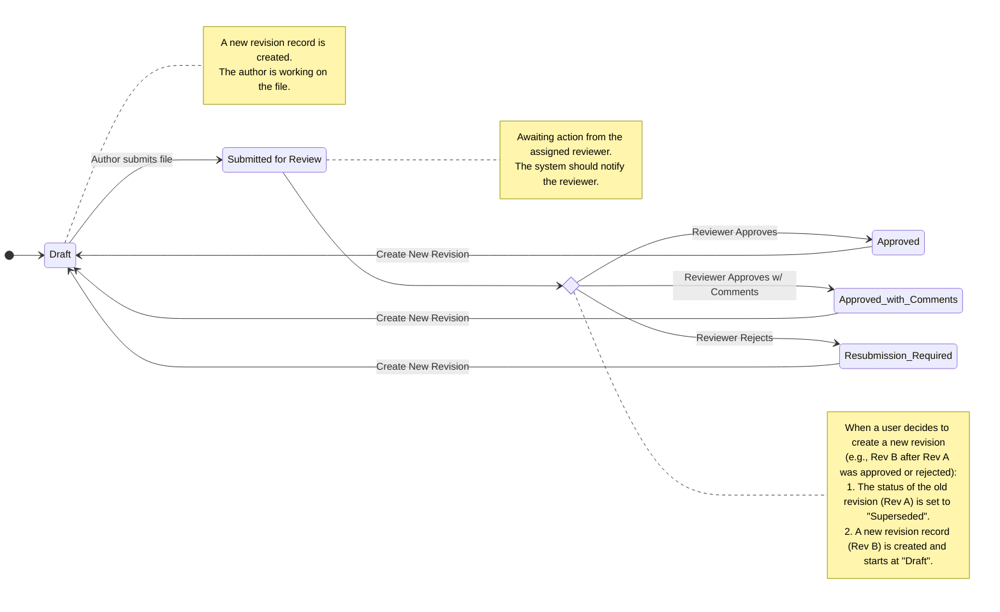
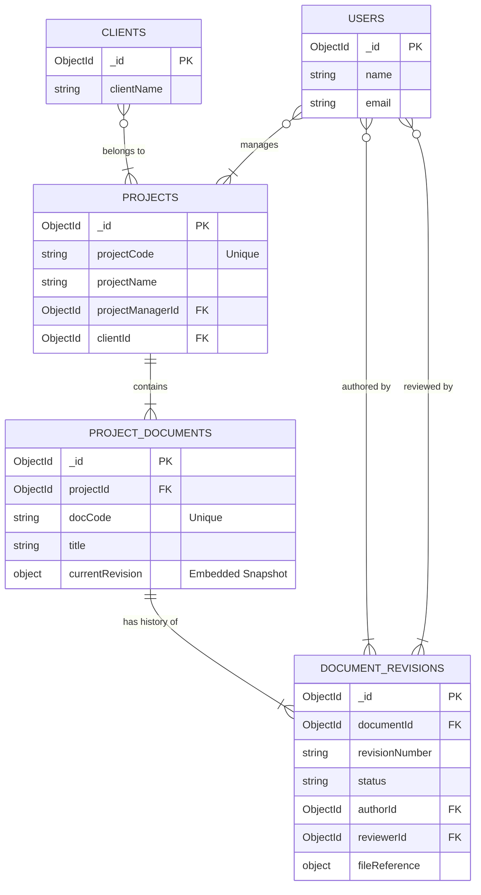
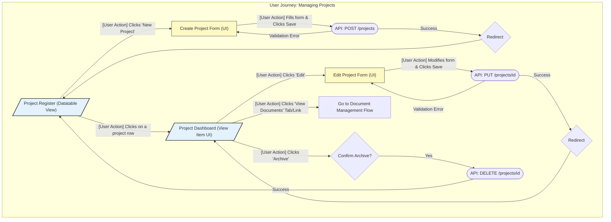

## 2025-09-05
### 1. Project Definition Structure (MongoDB Collection: `projects`)

In MongoDB, this will be your `projects` collection. Each document in this collection represents a single project.

#### Proposed Project Model (`Project.php`)

```php
// app/Models/Project.php
class Project extends Jenssegers\Mongodb\Eloquent\Model
{
    protected $connection = 'mongodb';
    protected $collection = 'projects';

    /**
     * The attributes that are mass assignable.
     *
     * @var array
     */
    protected $fillable = [
        'projectCode',
        'projectName',
        'description',
        'projectManagerId',
        'clientId',
        'status',
        'startDate',
        'plannedEndDate',
        'actualEndDate',
t       'budget',
        'currency',
    ];

    /**
     * The attributes that should be cast to native types.
     *
     * @var array
     */
    protected $casts = [
        'startDate' => 'datetime',
        'plannedEndDate' => 'datetime',
        'actualEndDate' => 'datetime',
        'budget' => 'float',
    ];
}
```

#### Field Definition (`projects` collection)

| Field Name | Data Type (MongoDB) | Description | Example |
| :--- | :--- | :--- | :--- |
| `_id` | ObjectId | Automatically generated unique identifier (Primary Key). | `ObjectId("63a0c2b...")` |
| `projectCode` | String (Unique Index)| A human-readable, unique identifier for the project. | `PROJ-2024-001` |
| `projectName` | String | The official name of the project. **(Required)** | `Corporate Website Redesign`|
| `description` | String | A detailed description of the project's scope and goals. | `To rebuild the public-facing website...`|
| `projectManagerId`| ObjectId | The `_id` of the user from the `users` collection. | `ObjectId("63a0d1e...")` |
| `clientId` | ObjectId | The `_id` of the client from a `clients` collection. Nullable. | `ObjectId("63a0e4f...")` |
| `status` | String | The project status. **(Required)** | `In Progress` |
| `startDate` | ISODate | The planned or actual start date of the project. | `2024-09-01T00:00:00.000Z`|
| `plannedEndDate` | ISODate | The originally planned completion date. | `2025-03-31T00:00:00.000Z`|
| `actualEndDate` | ISODate | The actual completion date. Null until completion. | `null` |
| `budget` | Double / Decimal128| The allocated budget for the project. Optional. | `250000.00` |
| `currency` | String | The currency of the budget (ISO 4217). | `USD` |
| `created_at` | ISODate | Automatically managed by Eloquent. | `...` |
| `updated_at` | ISODate | Automatically managed by Eloquent. | `...` |
| `isArchived` | Boolean | For soft-deleting projects. Defaults to `false`. | `false` |

#### Initial CRUD (Laravel/MongoDB Context)

*   **Create:** A standard `Project::create($validatedData)` call in your controller.
*   **Read (List):** `Project::where('isArchived', false)->get()` with filters applied via additional `where()` clauses.
*   **Read (Detail):** `Project::findOrFail($id)`.
*   **Update:** `$project->update($validatedData)`.
*   **Delete (Soft):** `$project->update(['isArchived' => true])`.

---

### 2. Organisation and Flow of Project Document Schedule & Tracking

With MongoDB, you have a choice: **embed** revisions within the parent document or keep them in a **separate collection**.

*   **Embedding:** Fast reads, but can lead to large documents (16MB limit) and makes querying across *all revisions* in the system difficult.
*   **Separate Collection (Referencing):** The recommended, more scalable approach. It mimics a relational structure but with the flexibility of NoSQL. It keeps document size manageable and allows for powerful queries on the revisions themselves.

Let's proceed with the **Separate Collection** approach.

#### Model 1: `ProjectDocument` (Collection: `projectDocuments`)

This collection holds the master record for each controlled document. It contains metadata and, crucially, a summary of its *current* state for fast lookups.

| Field Name | Data Type (MongoDB) | Description |
| :--- | :--- | :--- |
| `_id` | ObjectId | Unique identifier. |
| `projectId` | ObjectId | **Link** to the `projects` collection. **(Index this field)** |
| `docCode` | String | Unique document number. **(Index this field)** |
| `title` | String | The official title of the document. |
| `discipline` | String | E.g., `Civil`, `Mechanical`, `Software`. |
| `docType` | String | E.g., `Drawing`, `Specification`, `Report`. |
| `currentRevision` | **Embedded Document**| A denormalized snapshot of the latest active revision for quick display. |
| `created_at` | ISODate | Managed by Eloquent. |
| `updated_at` | ISODate | Managed by Eloquent. |

**Example of `currentRevision` Embedded Document:**
This is the key for performance. When you load the document list, you don't need a second query to find the status of every document.

```json
"currentRevision": {
  "revisionId": ObjectId("..."),
  "revisionNumber": "B",
  "status": "Approved",
  "authorId": ObjectId("..."),
  "plannedApprovalDate": ISODate("...")
}
```

#### Model 2: `DocumentRevision` (Collection: `documentRevisions`)

This collection is the auditable history—a log of every version of every document.

| Field Name | Data Type (MongoDB) | Description |
| :--- | :--- | :--- |
| `_id` | ObjectId | Unique identifier for this revision. |
| `documentId` | ObjectId | **Link** to the `projectDocuments` collection. **(Index this field)** |
| `revisionNumber` | String | The revision identifier (e.g., `A`, `B`, `0`, `1`). |
| `status` | String | `Draft`, `Submitted for Review`, `Approved`, `Resubmission Required`. |
| `authorId` | ObjectId | The `_id` of the user who created this revision. |
| `reviewerId` | ObjectId | The `_id` of the user assigned to review. |
| `plannedSubmissionDate`| ISODate | The target date for submission for review. |
| `actualSubmissionDate`| ISODate | The date the author submitted it. |
| `plannedApprovalDate`| ISODate | The target date for the reviewer to finish. |
| `actualApprovalDate`| ISODate | The date the reviewer set the final status. |
| `fileReference` | Embedded Document | Metadata about the stored file. |
| `created_at` | ISODate | Managed by Eloquent. |
| `updated_at` | ISODate | Managed by Eloquent. |

**Example of `fileReference` Embedded Document:**
This provides flexibility for different storage providers.

```json
"fileReference": {
  "storageDriver": "s3",
  "path": "project_xyz/SPEC-MECH-001_RevB.pdf",
  "filename": "SPEC-MECH-001_RevB.pdf",
  "mimeType": "application/pdf",
  "size": 2048576 // in bytes
}
```

#### Flow and CRUD (Laravel/MongoDB Context)

1.  **Create a New Document:**
*   A user fills out a form for a new document (`docCode`, `title`, etc.) within a project.
*   **Transactionally:**
1.  Create the `ProjectDocument` record.
2.  Create the first `DocumentRevision` record (e.g., Rev A) with `status: 'Draft'`.
3.  Update the `ProjectDocument`'s `currentRevision` embedded document with the info from the new revision.

2.  **Submit for Review (State Transition):**
*   The author uploads a file and clicks "Submit".
*   The backend updates the corresponding `DocumentRevision` record, changing `status` from `Draft` to `Submitted for Review` and setting `actualSubmissionDate`.
*   The `ProjectDocument`'s `currentRevision.status` is also updated to reflect this change.

3.  **Approve/Reject (State Transition):**
*   The reviewer makes a decision.
*   The backend updates the `DocumentRevision` record's `status` to `Approved` or `Resubmission Required`.
*   The `ProjectDocument`'s `currentRevision.status` is updated.

4.  **Create a New Revision:**
*   A user initiates a new revision (e.g., because the previous was `Resubmission Required` or needs an update).
*   **Transactionally:**
1.  Find the old `DocumentRevision` and update its `status` to `Superseded`.
2.  Create a *new* `DocumentRevision` record (e.g., Rev B) with `status: 'Draft'`.
3.  Update the parent `ProjectDocument`'s `currentRevision` embedded document to point to this new Rev B.

### Alternative Collection Views (How to Query)

The frontend views remain the same, but the backend queries will leverage this MongoDB structure.

#### 1. Document Register View (List-Based)

*   **Query:** Simply `ProjectDocument::where('projectId', $projectId)->get()`.
*   **Why it's fast:** All the necessary data (`docCode`, `title`, `currentRevision.status`, `currentRevision.revisionNumber`) is in the main document. No joins or lookups are needed to display the list, making it highly performant.

#### 2. Timeline View (Schedule-Based)

*   **Query:** `DocumentRevision::whereIn('documentId', $documentIds)->get()`. (`$documentIds` is an array of `_id`s from the project's documents).
*   **Logic:** This query fetches all historical and current revisions for the documents in the project. You can then iterate through these in your backend or frontend to build the timeline, plotting bars based on `plannedSubmissionDate` and `plannedApprovalDate`. You can filter this query for only the "active" revisions if needed.

#### 3. Kanban Board View (Workflow-Based)

*   **Query:** `ProjectDocument::where('projectId', $projectId)->get()`.
*   **Logic:** The data for the Kanban board also comes directly from the `projectDocuments` collection. The frontend logic would group the documents into columns based on the value of the `currentRevision.status` field. Drag-and-drop actions would trigger API calls to perform the state transitions described in the workflow above.

### Flow & Entity Diagram

Of course. Visualizing the flow and relationships is a crucial step. Here are the visualizations using Mermaid notation for both the document lifecycle flow and the data entity relationships.

---

### 1. Document Revision Workflow (The Flow)

This diagram illustrates the lifecycle of a **single document revision**. It shows the states a revision can be in and the actions that cause it to transition from one state to another.

The key concept is that actions like "Approve" or "Reject" are terminal for a specific revision (e.g., Rev A). To continue work, a *new revision* (Rev B) is created, which starts the lifecycle over again from the `Draft` state.



### 2. Data Entity Relationship Diagram (The Structure)

This ER diagram shows how the different MongoDB collections (`projects`, `projectDocuments`, `documentRevisions`, etc.) are related to each other. It clarifies the "one-to-many" relationships that form the backbone of your system.

*   A `Project` contains many `ProjectDocuments`.
*   A `ProjectDocument` has a history of many `DocumentRevisions`.
*   `Users` play multiple roles (Project Manager, Author, Reviewer).



#### How to Interpret the ER Diagram:

*   **`||--|{`**: Represents a "one-to-many" relationship. For example, one `PROJECTS` record is related to many `PROJECT_DOCUMENTS` records.
*   **`}o--|{`**: Also represents a "one-to-many" relationship, but drawn from the perspective of the "one" side. For example, one `USERS` record can be related to many `PROJECTS` as a manager.
*   **PK**: Stands for Primary Key (in MongoDB, this is the `_id`).
*   **FK**: Stands for Foreign Key. This indicates a field that stores the `_id` from another collection to create a relationship (e.g., `PROJECT_DOCUMENTS.projectId` stores a `PROJECTS._id`).

### UI / UX

Excellent request. Visualizing the user interface (UI) flow and its connection to the backend CRUD operations is key to understanding how the system will function.

Here are visualizations using Mermaid's flowchart notation. I've broken it down into the two main areas as before: **Project Management** and **Project Document Management**.

---

### 1. Project Management CRUD Flow

This diagram illustrates the user journey for managing the Project Register. It's a standard and straightforward CRUD implementation.



#### Explanation of the Project Flow:

1.  **Collection View (`Project Register`):**
*   The user starts at a list of all projects, presented in a **Datatable**. This is the main "Read" (List) screen.
*   From here, they can initiate creating a new project or select an existing one to view its details.

2.  **Create Form UI (`Create Project Form`):**
*   A simple form to input the project's details (`projectName`, `projectCode`, etc.).
*   Submitting this form makes a `POST` request to your API. On success, the user is redirected back to the register, which now shows the new project.

3.  **View Item UI (`Project Dashboard`):**
*   This is the detailed view of a single project. It displays all the project's information.
*   This page is the hub for actions related to *this specific project*, such as editing it, archiving it, or, most importantly, navigating to its associated documents.

4.  **Edit Form UI (`Edit Project Form`):**
*   Identical to the create form but is pre-populated with the existing project's data.
*   Submitting makes a `PUT` or `PATCH` request to update the record.

---

### 2. Project Document Management CRUD Flow

This flow is more complex because it involves multiple view types and a workflow-driven update process (state changes).

```mermaid
graph TD
    subgraph "User Journey: Managing Documents within a Project"
        Start[/"Project Dashboard"/] -- "[User Action] Navigates to Documents" --> Views;

        subgraph "Collection Views"
            direction LR
            Views(Choose View) --> V1[/"Datatable View"/];
            Views --> V2[/"Timeline View"/];
            Views --> V3[/"Kanban View"/];
            Views --> V4[/"Grid View (for drawings)"/];
            Views --> V5[/"Tree Datatable (for specs)"/];
        end

        V1 -- "[User Action] Clicks 'Add Document'" --> CreateForm;
        V2 -- "[User Action] Clicks 'Add Document'" --> CreateForm;
        V3 -- "[User Action] Clicks 'Add Document'" --> CreateForm;
        V4 -- "[User Action] Clicks 'Add Document'" --> CreateForm;
        V5 -- "[User Action] Clicks 'Add Document'" --> CreateForm;

        CreateForm["Create Document Form (UI)"] -- "[User Action] Fills metadata & Clicks Save" --> CreateAPI["API: POST /documents"];
        CreateAPI -- "Success" --> Views;
        CreateAPI -- "Error" --> CreateForm;

        V1 -- "[User Action] Clicks on a document" --> ViewItem;
        V2 -- "[User Action] Clicks on a document" --> ViewItem;
        V3 -- "[User Action] Clicks on a card" --> ViewItem;
        V4 -- "[User Action] Clicks on a tile" --> ViewItem;
        V5 -- "[User Action] Clicks on a node" --> ViewItem;

        ViewItem[/"Document Detail Page (View Item UI)"/];
        subgraph "Document Detail Actions"
            ViewItem -- "[User Action] Clicks 'Edit Metadata'" --> EditForm["Edit Document Form (UI)"];
            EditForm -- "Saves" --> EditAPI["API: PUT /documents/{id}"];
            EditAPI -- "Success" --> ViewItem;

            ViewItem -- "[User Action] Clicks 'Create New Revision'" --> RevForm["Create Revision Form (UI)<br/>- Upload File<br/>- Set Dates"];
            RevForm -- "Saves" --> RevAPI["API: POST /documents/{id}/revisions"];
            RevAPI -- "Success" --> ViewItem;
        end

        subgraph "Special Case: Kanban Workflow Update"
            V3 -- "[User Action] Drags card from<br/>'Draft' to 'For Review'" --> KanbanUpdate["API: PATCH /revisions/{rev_id}/status"];
            KanbanUpdate -- "Success" --> V3;
        end
    end

    %% Styling
    style Start fill:#c8e6c9,stroke:#333,stroke-width:2px
    style Views fill:#b3e5fc,stroke:#333,stroke-width:2px
    style ViewItem fill:#e3f2fd,stroke:#333,stroke-width:2px
    style V1 fill:#f5f5f5,stroke:#333
    style V2 fill:#f5f5f5,stroke:#333
    style V3 fill:#f5f5f5,stroke:#333
    style V4 fill:#f5f5f5,stroke:#333
    style V5 fill:#f5f5f5,stroke:#333
    style CreateForm fill:#fff9c4,stroke:#333
    style EditForm fill:#fff9c4,stroke:#333
    style RevForm fill:#fff9c4,stroke:#333
```



#### Explanation of the Document Flow:

1.  **Entry Point (`Project Dashboard`):** The user is already looking at a specific project and chooses to manage its documents.

2.  **Collection Views (The Core):**
*   The user is presented with one or more ways to view the document register. A toggle or menu allows them to switch between views.
*   **Datatable:** The default, information-rich view.
*   **Timeline:** Visualizes the schedule.
*   **Kanban:** Visualizes the workflow status.
*   **Grid:** Best for visually-oriented documents like architectural drawings or mockups, showing thumbnails.
*   **Tree Datatable:** Ideal for complex document sets where documents are nested, like a master specification with multiple sub-sections.
*   All these views offer two primary actions: **Add a new document** or **View an existing document's details**.

3.  **Create Form UI (`Create Document Form`):**
*   This form is for creating the *master document record* (`ProjectDocument`). It captures metadata like the `docCode` and `title`. The initial revision is typically created automatically in the background with a `Draft` status.

4.  **View Item UI (`Document Detail Page`):**
*   This is the hub for a single document. It shows all its metadata and, most importantly, a **list of its revisions** (Rev A, Rev B, etc.).
*   From here, the user can perform two distinct types of "updates":
*   **Edit Metadata:** Changes the master document record (e.g., correcting a typo in the title).
*   **Create New Revision:** This is the main workflow action. It opens a form to upload a new file, creating a new `DocumentRevision` record and starting its lifecycle.

5.  **Special Case - Kanban Update:**
*   The Kanban view offers a unique, streamlined update process. Instead of opening a form, the user can simply **drag a card** from one column (e.g., `Submitted for Review`) to another (e.g., `Approved`).
*   This UI action triggers a direct `PATCH` request to the API to update only the `status` of that revision, providing a fast and intuitive user experience for managing workflow.

## Wireframes ( Table Based )

Absolutely. Here is the combined output, pairing each UI wireframe (approximated in a Markdown table) with its detailed component breakdown. This provides both a visual layout and a functional explanation for each key screen.

---

### 1. Project Register (List/Datatable View)

#### UI Layout

| Component / Layout | |
| :--- | :--- |
| **Project Register** | `[ User Menu ]` |
| **`[ + New Project Button ]`** | |
| `[ Search: [      ] ]` `[ Filter: Status [Dropdown] ▼ ]` `[ Filter: PM [Dropdown] ▼ ]` | |
| **`Project Code ▲`** | **`Project Name`** | **`Project Manager`** | **`Status`** | **`Planned End Date`** |
| `PROJ-2024-001` | `Corporate Website Redesign` | `John Doe` | `In Progress` | `2025-03-31` |
| `PROJ-2024-002` | `Mobile App Development` | `Jane Smith` | `Completed` | `2024-10-15` |
| *... more rows ...* | | | | |
| `[ << Prev ] [ 1 ] [ 2 ] [ 3 ] [ Next >> ]` | |

#### Component Breakdown

**Purpose:** To display a list of all active projects, allowing users to search, filter, and navigate to a specific project or create a new one.

| Section | Component | Description / Purpose |
| :--- | :--- | :--- |
| **Header** | Title | "Project Register" |
| | User Menu | Standard user profile and logout options. |
| **Toolbar** | **Button: `+ New Project`** | **Primary Action.** Navigates the user to the "Create Project Form". |
| | Search Input | Allows users to search for projects by `projectCode` or `projectName`. |
| | Filter Dropdown | Filter the list by `Status` (e.g., In Progress, Completed). |
| | Filter Dropdown | Filter the list by `Project Manager`. |
| **Main Content**| **Datatable** | The main list of projects. |
| | Table Columns | `Project Code`, `Project Name`, `Project Manager`, `Status`, `Planned End Date`. |
| | Table Row Interaction | **Clicking on any row** navigates the user to that project's "Project Dashboard". |
| **Footer** | Pagination Controls | Allows users to navigate through multiple pages of projects. |

---

### 2. Create / Edit Project Form

#### UI Layout

| Component / Layout | |
| :--- | :--- |
| **Create New Project** (or **Edit Project: [Name]**) | |
| `< Back to Project Register` | |
| **Project Code** | `[ Input Field (Readonly on Edit) ]` *(Required)* |
| **Project Name** | `[ Input Field ]` *(Required)* |
| **Description** | `[ Textarea Field ]` |
| **Project Manager**| `[ Dropdown (User List) ▼ ]` *(Required)* |
| **Client** | `[ Dropdown (Client List) ▼ ]` |
| **Status** | `[ Dropdown (Planning, In Progress, ...) ▼ ]` *(Required)* |
| **Start Date** | `[ Date Picker ]` |
| **Planned End Date**| `[ Date Picker ]` |
| **Budget** | `[ Number Input ]` `[ Dropdown (USD) ▼ ]` |
| | `[ Cancel ]` **`[ Save ]`** |

#### Component Breakdown

**Purpose:** To provide a user interface for entering or modifying project details. The view is shared for both "Create" and "Edit" modes.

| Section | Component | Description / Purpose |
| :--- | :--- | :--- |
| **Header** | Title | Dynamically displays "Create New Project" or "Edit Project: [Project Name]". |
| | Link: `< Back` | Navigates back to the "Project Register" or "Project Dashboard" without saving. |
| **Form Fields** | Input: `Project Code` | Text field. **Required and must be unique.** Should be *read-only* in Edit mode. |
| | Input: `Project Name` | Text field. **Required.** |
| | Textarea: `Description` | Multi-line text field for a detailed project description. |
| | Dropdown: `Project Manager` | Select a user from a pre-populated list of users. **Required.** |
| | Dropdown: `Client` | Select from a list of clients. Optional. |
| | Dropdown: `Status` | Select from `Planning`, `In Progress`, `On Hold`, `Completed`, etc. **Required.** |
| | Date Picker: `Start Date` | A calendar input for the project's start date. |
| | Date Picker: `Planned End Date` | A calendar input for the project's target completion date. |
| | Number Input: `Budget` | A field for the project's budget amount. |
| **Action Bar** | Button: `Cancel` | Discards changes and navigates back. |
| | Button: `Save` | Submits the form data to the API. On success, navigates to the "Project Dashboard". |

---

### 3. Project Dashboard (View Project Details)

#### UI Layout

| Component / Layout | |
| :--- | :--- |
| **Project Dashboard: Corporate Website Redesign** | `[ User Menu ]` |
| `< Back to Register` | **`[ Edit Project ]`** **`[ Archive Project ]`** |
| --- | --- |
| **`[ Overview (Active) ]`** `[ Documents ]` `[ Team ]` | |
| **Project Details** | |
| `Project Code:` | `PROJ-2024-001` |
| `Status:` | `In Progress` |
| `Project Manager:`| `John Doe` |
| `Client:` | `ACME Inc.` |
| `Start Date:` | `2024-09-01` |
| `Planned End Date:`| `2025-03-31` |
| `Description:` | `To rebuild the public-facing website on a new platform...` |

#### Component Breakdown

**Purpose:** To serve as the central hub for a single project, displaying all its information and providing navigation to related modules like documents.

| Section | Component | Description / Purpose |
| :--- | :--- | :--- |
| **Header** | Title | Displays the full `Project Name`. |
| | Link: `< Back to Register` | Navigates back to the main "Project Register" list. |
| **Toolbar** | Button: `Edit Project` | Navigates to the "Edit Project Form" pre-filled with this project's data. |
| | Button: `Archive Project` | Initiates the soft-delete process for the project (with confirmation). |
| **Main Content**| **Tab Navigation** | Allows switching between different sections of the project. |
| | Tab: `Overview` | The default active tab. Displays the "Project Details" section below. |
| | Tab: `Documents` | **Key Action.** Switches the view to the "Document Register" for this project. |
| | Tab: `Team` | (Future) A section to manage project team members. |
| | **Project Details Section** | A read-only display of all project fields (Code, Name, Manager, Dates, etc.). |

---

### 4. Document Register (List/Datatable View)

#### UI Layout

| Component / Layout | |
| :--- | :--- |
| **Documents: Corporate Website Redesign** | `[ User Menu ]` |
| `< Back to Dashboard` | **`[ + Add Document ]`** `View As: [Datatable ▼]` |
| `[ Search: [      ] ]` `[ Filter: Discipline [Dropdown] ▼ ]` `[ Filter: Status [Dropdown] ▼ ]` | |
| **`Doc Code ▲`** | **`Title`** | **`Rev`** | **`Status`** | **`Author`** | **`Planned Date`** |
| `PROJ-SPEC-001` | `Functional Specification` | `B` | `Approved` | `Jane Smith` | `2024-11-15` |
| `PROJ-DRW-001` | `Homepage Mockup` | `C` | `For Review`| `John Doe` | `2024-12-01` |
| *... more rows ...* | | | | | |
| `[ << Prev ] [ 1 ] [ 2 ] [ 3 ] [ Next >> ]` | |

#### Component Breakdown

**Purpose:** Located within a project, this view lists all documents associated with it and allows users to switch between different visualization modes.

| Section | Component | Description / Purpose |
| :--- | :--- | :--- |
| **Header** | Title | "Documents for Project: [Project Name]" |
| | Link: `< Back to Dashboard` | Navigates back to the project's "Overview" tab. |
| **Toolbar** | **Button: `+ Add Document`** | **Primary Action.** Opens a form to create a new master document record. |
| | Dropdown: `View As` | Switches the main content between `Datatable`, `Timeline`, `Kanban`, `Grid`. |
| | Search Input | Allows users to search for documents by `docCode` or `title`. |
| | Filter Dropdown | Filter the list by `Discipline` (e.g., Civil, Mechanical). |
| | Filter Dropdown | Filter the list by current revision `Status` (e.g., Approved, For Review). |
| **Main Content**| **Datatable** | The default view, showing a list of documents. |
| | Table Columns | `Doc Code`, `Title`, `Current Revision`, `Status`, `Discipline`, `Author`, `Planned Date`. |
| | Table Row Interaction | **Clicking on any row** navigates the user to that document's "Document Detail Page". |
| **Footer** | Pagination Controls | Allows users to navigate through multiple pages of documents. |

---

### 5. Document Detail Page (View Document Details)

#### UI Layout

| Component / Layout | |
| :--- | :--- |
| **Document: PROJ-SPEC-001** | `[ User Menu ]` |
| `< Back to Document List` | **`[ Edit Metadata ]`** **`[ Create New Revision ]`** |
| --- | --- |
| **Document Metadata** | |
| `Title:` | `Functional Specification` |
| `Discipline:` | `Software` |
| `Doc Type:` | `Specification` |
| --- | --- |
| **Revision History** | |
| **`Revision`** | **`Status`** | **`Author`** | **`Submitted On`**| **`File`** |
| `B` | `Approved` | `Jane Smith` | `2024-11-14` | `[ Download ]` |
| `A` | `Superseded` | `John Doe` | `2024-10-30` | `[ Download ]` |

#### Component Breakdown

**Purpose:** To display the complete information and version history for a single document.

| Section | Component | Description / Purpose |
| :--- | :--- | :--- |
| **Header** | Title | Displays the `docCode` and `title`. |
| | Link: `< Back to List` | Navigates back to the "Document Register". |
| **Toolbar** | Button: `Edit Metadata` | Opens a form to edit the master document's details (e.g., `title`, `discipline`). |
| | **Button: `Create New Revision`** | **Primary Action.** Opens a form to upload a new version of the file. |
| **Metadata Section** | Read-only Fields | Displays the document's core metadata: `Doc Code`, `Title`, `Discipline`, `Doc Type`. |
| **Revisions Section** | **Table: `Revision History`** | Lists every version of the document from newest to oldest. |
| | Table Columns | `Revision`, `Status`, `Author`, `Reviewer`, `Planned Date`, `Actual Date`, `File`. |
| | File Link | A link in each row to download the specific file associated with that revision. |

---

### 6. Create New Revision Form

#### UI Layout

| Component / Layout | |
| :--- | :--- |
| **Create New Revision for: PROJ-SPEC-001** | |
| `< Back to Document Details` | |
| **Revision Number** | `[ "C" (Readonly, Auto-generated) ]` |
| **Upload File** | `[ Choose File... ]` *(Required)* |
| **Planned Submission Date** | `[ Date Picker ]` |
| **Planned Approval Date** | `[ Date Picker ]` |
| | `[ Cancel ]` **`[ Save Revision ]`** |

#### Component Breakdown

**Purpose:** A focused form for uploading a new version of an existing document and setting its schedule.

| Section | Component | Description / Purpose |
| :--- | :--- | :--- |
| **Header** | Title | "Create New Revision for: [Doc Code]" |
| | Link: `< Back to Details` | Navigates back to the "Document Detail Page" without saving. |
| **Form Fields** | Read-only Text: `Revision` | Displays the new revision number (e.g., "C"), which is automatically determined. |
| | File Input: `Upload File` | **Required.** The primary field for uploading the document file. |
| | Date Picker: `Planned Submission` | The target date for the author to submit this revision for review. |
| | Date Picker: `Planned Approval` | The target date for the reviewer to complete their review. |
| **Action Bar** | Button: `Cancel` | Discards changes and navigates back. |
| | Button: `Save Revision` | Submits the form. Creates the new revision record and uploads the file. |


## Wireframes ( Text Based )

Okay, here are basic wireframes for the key CRUD views we've discussed, focusing on layout and core elements. These wireframes are simple sketches, not fully designed UIs. They're meant to illustrate the structure and interaction flow.

---

### 1. Project Register (List/Datatable View)

```
+-------------------------------------------------------------------+
| [Logo]              Project Register                   [User Menu] |
+-------------------------------------------------------------------+
| [ + New Project Button ]                                          |
+-------------------------------------------------------------------+
| [ Search:  [  ]  ]  [ Filter: Status [Dropdown]  ] [ Filter: PM [Dropdown] ] |
+-------------------------------------------------------------------+
| Table Header: Code | Name | Project Manager | Status | Planned End Date | ... |
|-------------------------------------------------------------------|
| Data Row 1: PROJ-001 | Web Redesign | John Doe | In Progress | 2024-12-31 | ... |
| Data Row 2: PROJ-002 | Mobile App | Jane Smith | Completed | 2024-10-15 | ... |
| Data Row 3: ...       | ...        | ...         | ...       | ...          | ... |
| ...                                                                 |
+-------------------------------------------------------------------+
| Pagination: [ << Prev ]  1  2  3  [ Next >> ]                     |
+-------------------------------------------------------------------+
```

**Key Elements:**

*   **"New Project" Button:** Initiates the Create operation.
*   **Search & Filters:** Allow users to quickly find projects.
*   **Datatable:** Columns display key project information. Clicking on a row navigates to the Project Dashboard.
*   **Pagination:** Handles large numbers of projects.

---

### 2. Create/Edit Project Form

```
+-------------------------------------------------------------------+
| [Logo]               [ Create/Edit Project ]                [User Menu] |
+-------------------------------------------------------------------+
| [ Back to Project Register ]                                     |
+-------------------------------------------------------------------+
| Project Code:    [ Input Field (Readonly on Edit) ]  (Required)   |
| Project Name:    [ Input Field ]                       (Required)   |
| Description:      [ Textarea ]                                    |
| Project Manager: [ Dropdown (User List) ]            (Required)   |
| Client:           [ Dropdown (Client List) ]                       |
| Status:           [ Dropdown (Planning, In Progress, ...) ] (Required) |
| Start Date:       [ Date Picker ]                       (Required)   |
| Planned End Date: [ Date Picker ]                                   |
| Actual End Date:  [ Date Picker ]                                   |
| Budget:           [ Number Input ]                                  |
| Currency:         [ Dropdown (USD, EUR, ...) ]                      |
+-------------------------------------------------------------------+
| [ Cancel ]  [ Save ]                                                |
+-------------------------------------------------------------------+
```

**Key Elements:**

*   **Title:** Indicates whether it's a Create or Edit form.
*   **"Back" Button:** Returns to the Project Register or Dashboard.
*   **Form Fields:** Capture all project data.
*   **Required Indicators:** Clearly marks mandatory fields.
*   **"Cancel" & "Save" Buttons:** Actions for the form.  `Project Code` should be disabled in edit mode.

---

### 3. Project Dashboard (View Project Details)

```
+-------------------------------------------------------------------+
| [Logo]          Project Dashboard - [Project Name]       [User Menu] |
+-------------------------------------------------------------------+
| [ Back to Project Register ]   [ Edit Project ] [ Archive Project ] |
+-------------------------------------------------------------------+
| Project Code:    [ PROJ-001 (Display Only) ]                      |
| Project Name:    [ Web Redesign (Display Only) ]                  |
| Description:      [ Multi-line Description (Display Only) ]       |
| Project Manager: [ John Doe (Display Only) ]                      |
| Client:           [ Acme Corp (Display Only) ]                      |
| Status:           [ In Progress (Display Only) ]                   |
| Start Date:       [ 2024-09-01 (Display Only) ]                   |
| Planned End Date: [ 2024-12-31 (Display Only) ]                   |
| Actual End Date:  [  (Display Only) ]                              |
| Budget:           [ $100,000 (Display Only) ]                     |
+-------------------------------------------------------------------+
| [Tab Navigation:  Overview  |  Documents  |  Team  |  ... ]       |
+-------------------------------------------------------------------+
```

**Key Elements:**

*   **Title:** Shows the Project Name.
*   **"Back" Button:** Returns to the Project Register.
*   **Action Buttons:** "Edit" and "Archive".
*   **Display Fields:** Presents all project data in a read-only format.
*   **Tab Navigation:** Organizes related information (documents, team members, risks, issues, etc.).  The "Documents" tab leads to the Document Management views.

---

### 4. Document Register (List/Datatable View)

This view is within the Project Dashboard, under the "Documents" tab.

```
+-------------------------------------------------------------------+
| [Logo]      Project: [Project Name] - Documents          [User Menu] |
+-------------------------------------------------------------------+
| [ Back to Project Dashboard ] [ + Add Document ] [ View: [Dropdown] ]|
+-------------------------------------------------------------------+
| [ Search:  [  ]  ]  [ Filter: Discipline [Dropdown]  ] [ Filter: Status [Dropdown] ] |
+-------------------------------------------------------------------+
| Table Header: Code | Title | Rev | Status | Discipline | Author | Planned Date | ... |
|-------------------------------------------------------------------|
| Data Row 1: SPEC-001 | Specification | B | Approved | Mechanical | Jane | 2024-11-15 | ... |
| Data Row 2: DRW-002  | Layout Plan | C | Resubmission | Civil | John | 2024-12-01 | ... |
| Data Row 3: ...       | ...         | ... | ...       | ...        | ...  | ...       | ... |
| ...                                                                 |
+-------------------------------------------------------------------+
| Pagination: [ << Prev ]  1  2  3  [ Next >> ]                     |
+-------------------------------------------------------------------+
```

**Key Elements:**

*   **"Back" Button:** Returns to the Project Dashboard.
*   **"+ Add Document" Button:** Creates a new `ProjectDocument` record.
*   **"View" Dropdown:** Selects between Datatable, Timeline, Kanban, Grid, Tree Table views.
*   **Filters:** Specific to document attributes (Discipline, Status).
*   **Datatable:**  Displays document metadata.  Clicking a row leads to the Document Detail Page.

---

### 5. Document Detail Page (View Document Details)

```
+-------------------------------------------------------------------+
| [Logo]    Project: [Project Name] - Document: [Doc Code]   [User Menu] |
+-------------------------------------------------------------------+
| [ Back to Document List ] [ Edit Metadata ] [ Create New Revision ] |
+-------------------------------------------------------------------+
| Document Code:  [ SPEC-001 (Display Only) ]                        |
| Title:            [ Specification (Display Only) ]                   |
| Discipline:       [ Mechanical (Display Only) ]                      |
| Document Type:    [ Specification (Display Only) ]                    |
+-------------------------------------------------------------------+
| [Revisions Table:]                                                 |
| Revision | Status | Author | Planned Date | Actual Date | File | Actions |
|----------|--------|--------|--------------|-------------|------|---------|
| Rev A    | Approved | Jane   | 2024-10-31   | 2024-10-30  | [Download] | [View] |
| Rev B    | Current | John   | 2024-11-15   |             | [Download] | [View] |
| ...                                                                 |
+-------------------------------------------------------------------+
```

**Key Elements:**

*   **"Back" Button:** Returns to the Document List.
*   **"Edit Metadata" Button:** Allows editing of the core document record.
*   **"Create New Revision" Button:** Initiates the upload of a new file and the creation of a new `DocumentRevision`.
*   **Document Metadata:** Displays the document's main attributes.
*   **Revisions Table:** Shows the history of revisions for the document, including their status, author, dates, and the download link for the file.
*   The "Actions" column might include a "View" action to see *more details about a specific revision*, though that's often not needed given the information already present.
---

### 6.  Create New Revision Form
```
+-------------------------------------------------------------------+
| [Logo]    Project: [Project Name] - Document: [Doc Code]   [User Menu] |
+-------------------------------------------------------------------+
| [ Back to Document Details ]                                         |
+-------------------------------------------------------------------+
| Revision Number:  [ Automatically Generated (e.g., "B") ] (Readonly) |
| Upload File:        [ File Upload Input ]                             |
| Planned Submission Date:  [ Date Picker ]                           |
| Planned Approval Date:    [ Date Picker ]                           |
+-------------------------------------------------------------------+
| [ Cancel ] [ Save ]                                                  |
+-------------------------------------------------------------------+

```

**Key Elements:**
* Clear Label : Indicates the form for creating new revision
* Important Input : Date Pickers to specify the schedule
* Important Input : File Upload field to put latest document version.

These wireframes are starting points. The specifics of your UI will depend on your design choices, target users, and the overall look and feel you want to achieve.

